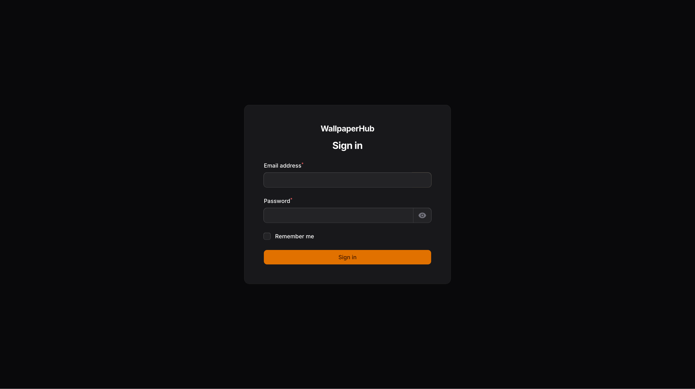
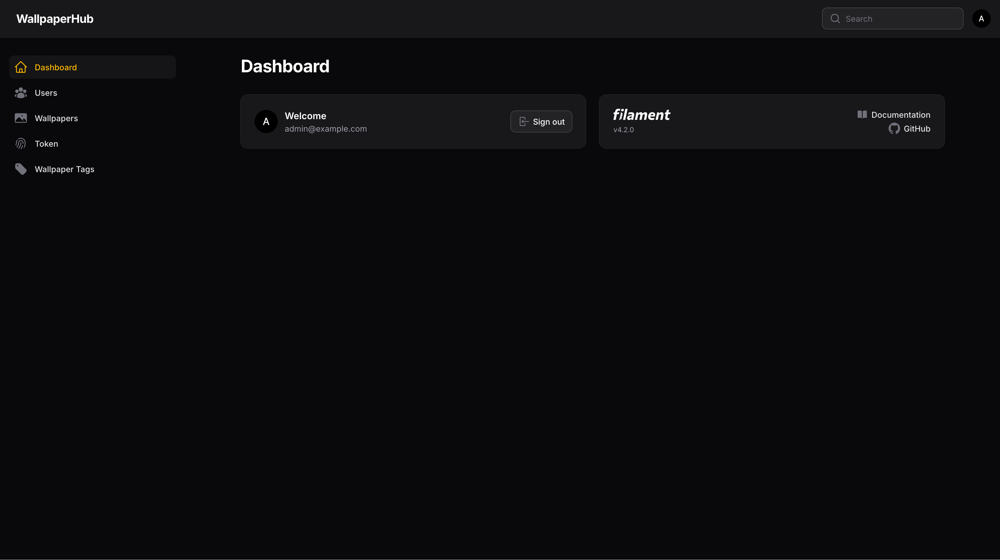
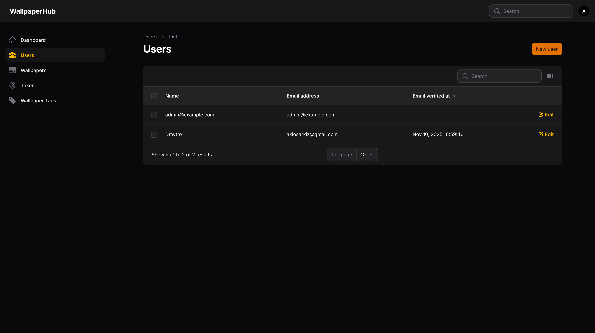
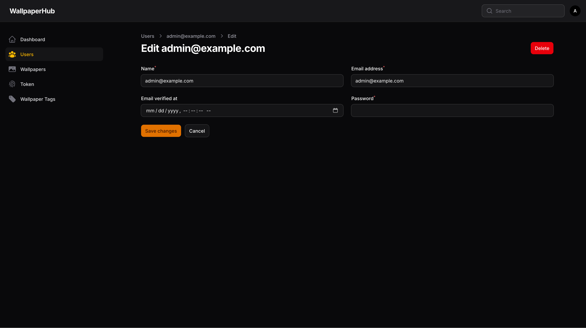
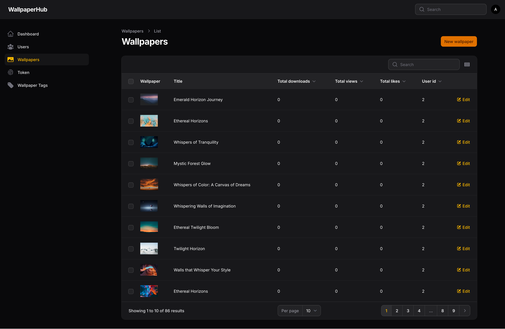
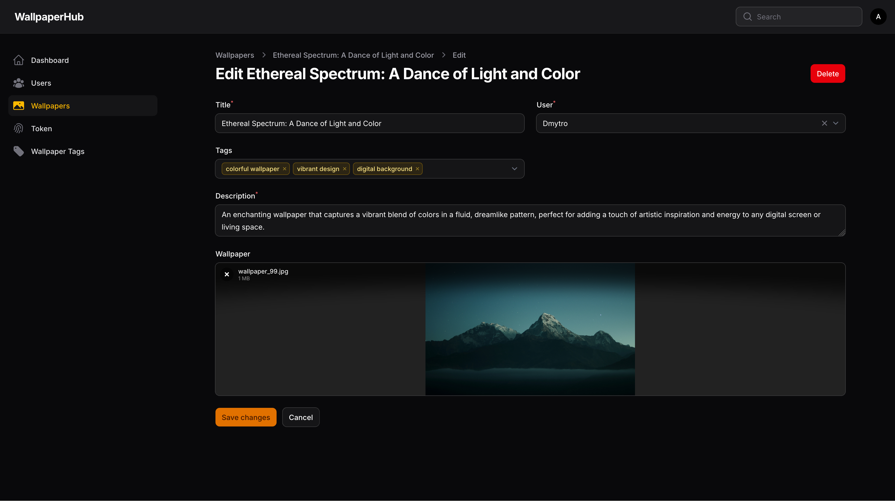
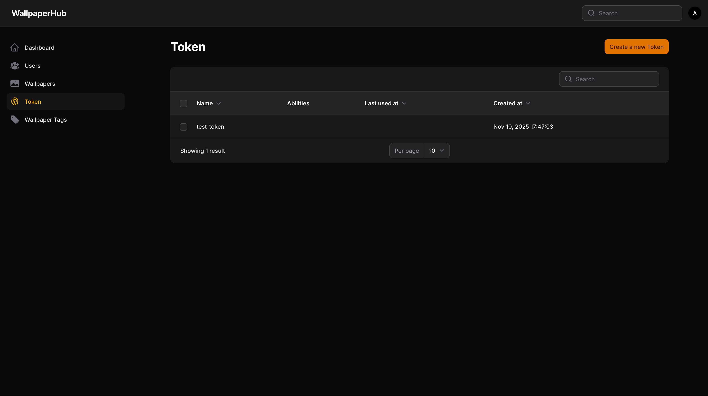
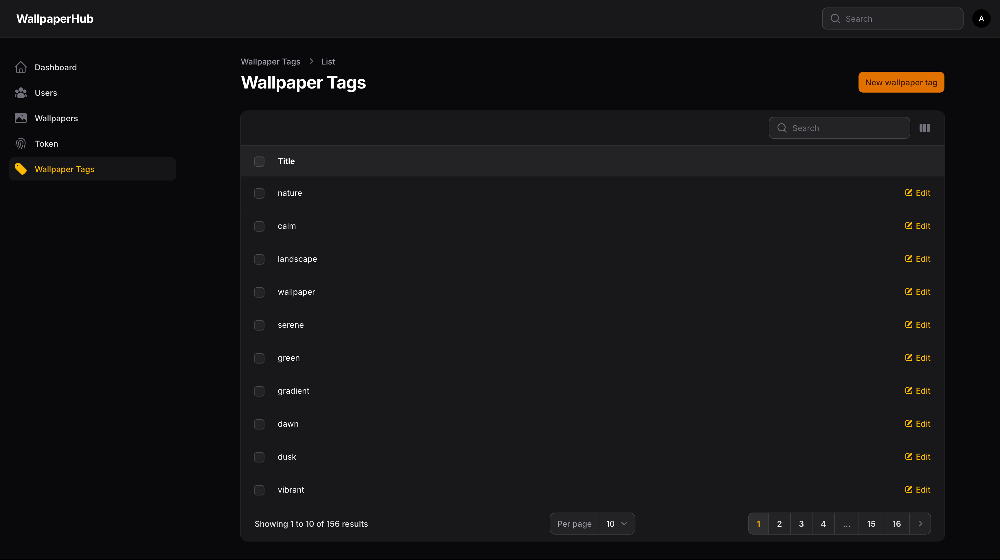

# Wallpaperhub backend

The repository contains backend part of the wallpaperhub project.

## Features

- User authentication
- Wallpaper upload with image processing (thumbnails, optimization)
- Tagging system with search and filtering
- Downloads / likes system
- Admin panel
- Rate limiting & security headers
- API-first design with JSON responses

## Tech Stack

- **Framework**: Laravel 12.x
- **Language**: PHP 8.4
- **Database**: PostgreSQL
- **Queue**: Redis
- **Storage**: S3
- **Image Processing**: Laravel Media Library
- **Authentication**: Laravel Sanctum (API tokens)
- **Search engine**: Meilisearch
- **Admin panel**: filamentphp

## Prerequisites

- Docker installed on the machine
- Git installed on the machine

## Installation

1. Copy the repository

```bash
git clone git@github.com:AkioSarkiz/wallpaperhub-backend.git
```

2. Copy `.env.example` as `.env`

3. Fill in necessary information in the `.env` file

4. Run the docker compose services

```bash
docker compose up -d
```

### Create default admin user

Here is the command you can use to create a default admin user. You will be prompt to fill necessary information.

```bash
docker compose exec app php artisan filament:make-user
```

### Seed default wallpaper

You might want to seed some information to the database, I can easily do that. Run the command bellow to seed information in the database.

> [!NOTE]
> We pass `-d memory_limit=256M` to bypass memory limitation and and ` -d max_execution_time=0` to bypass time limitation.


```bash
docker compose exec app php -d memory_limit=256M -d max_execution_time=0 artisan db:seed WallpaperSeeder
```

## Screenshots of the admin panel

#### Login page


#### Dashboard page


### Users page


### Users detailed page


### Wallpapers page


### Wallpapers detailed page


### Tokens page


### Wallpapers tags

